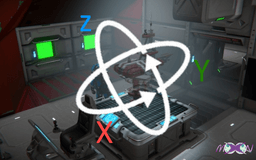

# console-hologram-spinner

<sub><sup>Made with VSCode using [reksar/SpaceEngineers](https://github.com/reksar/SpaceEngineers)</sup></sub>




Use this script to animate the preview (hologram) of a console block. By default it is static, so if you want it, you need a script to animate it.

All configuration must be done in the Custom Data field of the **Programmable Block** you are running this script from.

To set which **Console Block** to use set the name of it with:
  ```ini
  ConsoleName = MyConsoleBlock
  ```

To change direction of the rotation add to the custom data:
  ```ini
  RotationVector = 1, 0, 0
  ```
Change the numbers 1, 0, 0 to the speed in X, Y and Z directions you want.

To change the refresh mode of the script add :
  ```ini
  RefreshMode = Fast
  ```
Types of refresh modes: Fast (1hz), Normal (10hz), Slow (100hz)

Example of complete configuration:

```ini
ConsoleName = HologramShip
RotationVector = 1, 1, 1
RefreshMode = Fast
```
